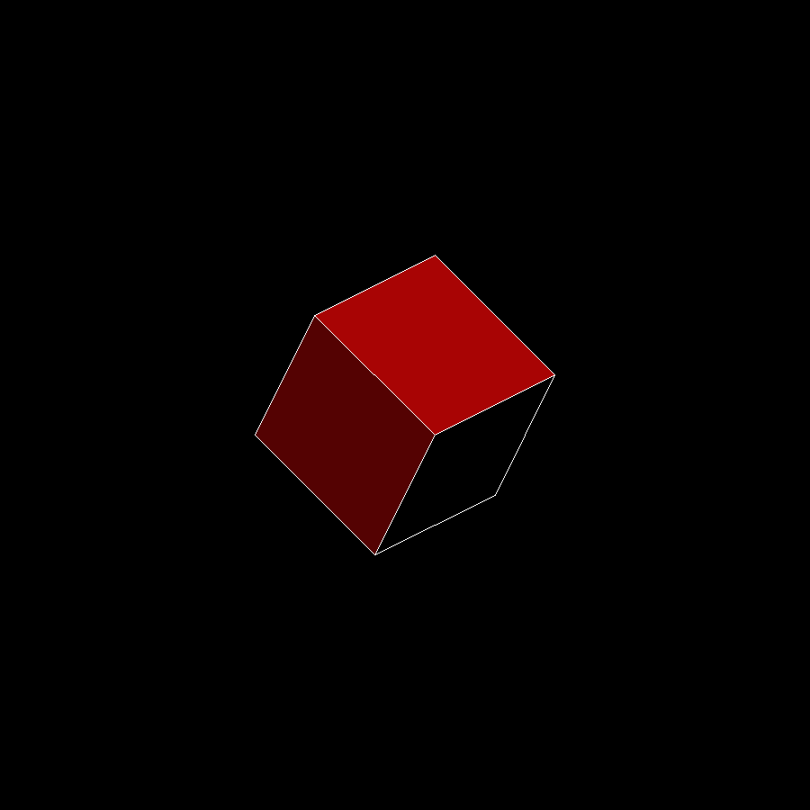
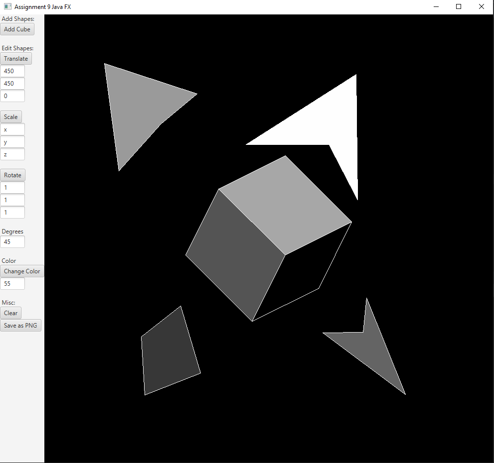
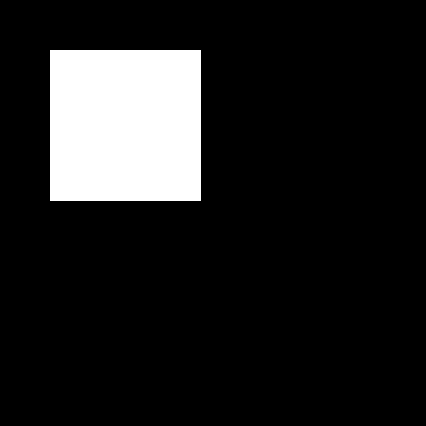
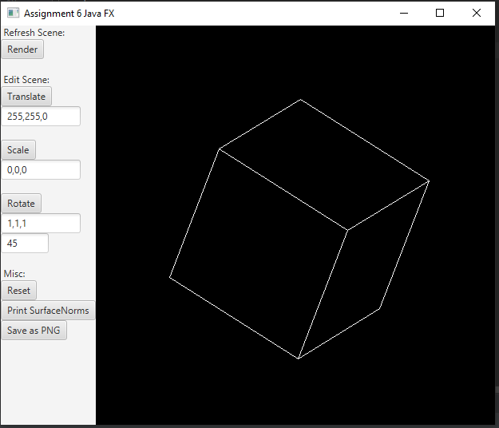
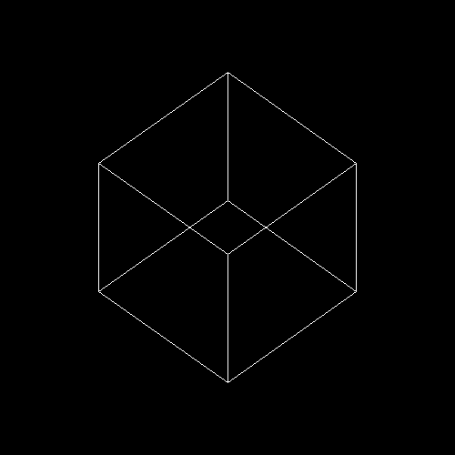
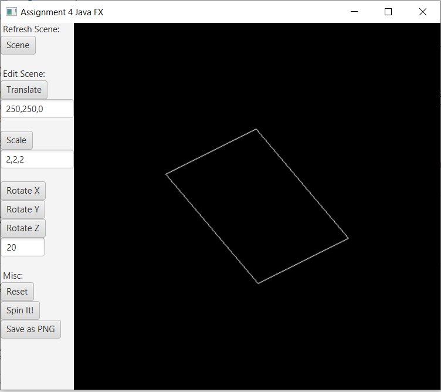
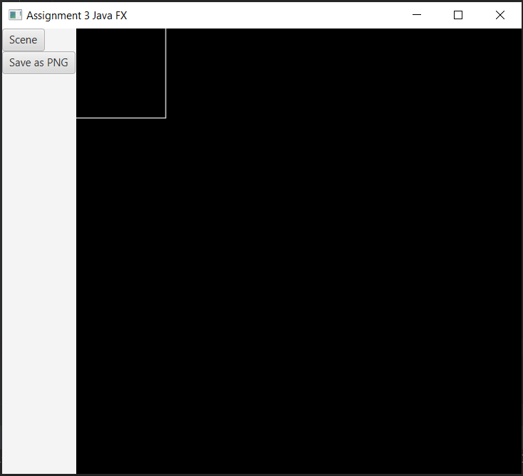
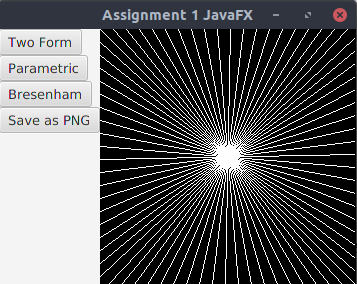
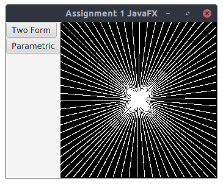
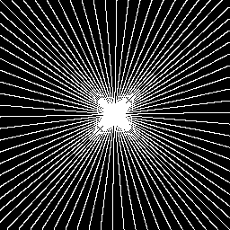

# 3D-GSAlpha
A program that utilizes line drawing algorithms and Multi-variable Calculus to render and manipulate three-dimensional shapes. All graphics and rendering functions for this were made from scratch, not including the GUI which was made with JavaFX.

## Project Updates and Notes
### Update 1.1
- Switched IDE from Intellij to VSCode
- Now using maven, refactored code base
- Updated ReadMe
- Made a JAR file for the app

### Update 1.0
- Added Color!, able to change color of last shape created (rgb)
\
Overall the most important changes I added for the project are color manipulation for shapes and shape selection, you can click shapes to select them for applying transformations. 
By default any shape you create starts gray-scale, however you can adjust the color of the shapes via the panel by placing the red, green, and blue value in the corresponding boxes.\
This project includes a graphics concept of color and plays with keeping 3D shapes (,exclusively cubes,) consistent in coloring without too much repetition. This is to make the 3D shape feel more like a single entity. 
This is done by first checking if the user input is valid, then dividing the given input for each side by the number of sides, this way the color for each side will be different shades of the given color, but still stay within the RGB range.

#### What's Next?
As of now I've met all the goals I wanted for this project's performance, so technically it's finished. May make an executable file for this program, 
for ease of use or may make the UI easier to understand. Otherwise, no future plans for the project.\
[Here is a link](https://docs.google.com/presentation/d/1Di47DpCoiyYVsK7C8TN2UjEIrhWodFrH0cdEERU8Zu8/edit?usp=sharing) to a slideshow of the overall progress from Update 0.1 to 1.0\

### Update 0.9

\
- Updated UI; changed Reset to Clear, scene to Add Cube
- Updated UI, changed labels
- Updated UI, Transformation input options and default values
- Added functionality for creating custom 2D shapes (Details in Notes)
- Added functionality for color change, able to change color of last shape created (grayscale)
I had to rework the way my program rendered 3D shapes. Now for each side, it renders the shape in an empty array (,filled with -1s,) then merges it with the frame buffer. Originally, when filling there was a problem with a single side’s color overriding other colors. Thanks to this, I feel like the structure of my code is becoming more solid.
#### Note: 
- Left click - place point
- Right click - create shape from placed points

### Update 0.8
- Implemented Shading for shapes
\
There were definitely a few drawbacks before getting a reasonable solution, however after much hand tracing and drawing it was done. 
After finishing this I realized the resolution for my application is lower than it should be. Nonetheless, the project was done. 

### Update 0.7
- Wireframe is removed
- Added to Rotation functionality, more options for how to rotate the shape (ex: rotate 45 degrees around given axis [1,1,1])
\
The overall outcome and degree of success was great. Since I used the surface normals to render the sides what can be seen, I made it easier to confirm that it was functioning correctly (,unless I flipped everything). It didn’t take very much to figure out how the rotations worked, thankfully the only special case was for the x-axis rotation.

### Update 0.6
- Refactored Code Base, reorganized shape storage and package contents
- 3D Shapes have been implemented
- Updated UI, removed Spin It!
- Updated UI, added Print Surface Normals Button; prints the surface normals of each side of the shape (for each 2D shape in the 3D shape)
\
I’ve made Shape class to hold all the faces of the cube and an internal Shape2D class for holding and calculating the surface normals. The Shape and each of the faces have their own fixed-points as well. The only trouble I had was with the order of the points for surface normal calculations, however that was easily fixed with some rearrangement of the cube’s points.

### Update 0.5
- Implemented transformations for shapes
- Updated UI; added Translate, Scale, and Rotate options for scene objects
- Added Reset button, clears render
- Added Spin it!, rotates the scene with an AnimationTimers
\
Things got way easier to implement. The only problem I ran into was adding the spinning animation; Did research on AnimationTimers.

### Update 0.4
- Updated UI, removed Line Logic display buttons
- Updated UI, added Scene Button; Renders a 2D square
\
I ran into problems that make only some lines render for the square. After some testing I decided to clean up and re-evaluate some of my code. I realized that my Bresenham code still had some problems I didn’t see during testing. After that was fixed, I was able to render the square almost instantly.\
Note: run more test cases next time.

### Update 0.3
- Implemented Bresenham Line Logic
- Updated UI, added button for Bresenham Line Logic
- Updated UI, Added "Save as PNG" button, saves image in Render as PNG
\
Overall there was no problem with saving the image as an PNG, however implementing the Bresenham algorithm took a few tries. The algorithm I implemented was from Wikipedia under this [link](https://en.wikipedia.org/wiki/Bresenham%27s_line_algorithm#Algorithm)\

### Update 0.2
- Updated UI to support displaying selected line logic
\
I got my lines to render with ease, however I experienced problems when using the buttons to display the lines initially. A little experimentation allowed me to better understand the process JavaFx goes through when setting things up. 

### Update 0.l
- Implemented Two Point Line Logic
- Implemented Parametric Line Logic

\
I got the parametric form function to create a reasonable picture, however my two point form function is still a bit imperfect, the picture it creates is flawed in many ways. Most of my problems came from trying to perfect the two point form function, there has been improvement since my first test, however it could be better. 
